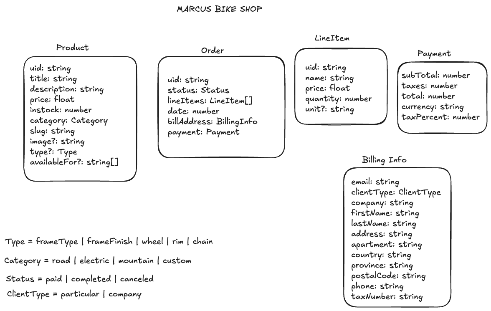

# Getting Started

## Requirements

- Node: v20.10.0

First make an `npm install`

Then, run the development server:

```bash
npm run dev
# or
yarn dev
# or
pnpm dev
# or
bun dev
```

Open [http://localhost:3000](http://localhost:3000) with your browser to see the result.

You can see the live result here [https://marcus-shop-lyart.vercel.app](https://marcus-shop-lyart.vercel.app)

## Description

Bicycle Shop

You're tasked with building a website that allows Marcus, a bicycle shop owner, to sell his bicycles.

Marcus owns a growing business and now wants to sell online. He also tells you that bicycles are his main product, but if the business continues to grow, he will surely start selling other sports-related items such as skis, surfboards, roller skates, etc. It would be a nice bonus if the same website allowed him to sell those things as well.

What makes Marcus's business successful is that customers can fully customize their bicycles. They can select many different options for the various parts of the bicycle. Here is an incomplete list of all the parts and their possible choices, to give an example:

- Frame type: Full-suspension, diamond, step-through
- Frame finish: Matte, shiny
- Wheels: Road wheels, mountain wheels, fat bike wheels
- Rim color: Red, black, blue
- Chain: Single-speed chain, 8-speed chain

On top of that, Marcus points out that some combinations are prohibited because they are not possible in reality. For example:

- If you select "mountain wheels," then the only frame available is the full-suspension.
- If you select "fat bike wheels," then the red rim color is unavailable because the manufacturer doesn't provide it.

Additionally, Marcus sometimes doesn't have all possible variations of each part in stock, so he wants to be able to mark them as "temporarily out of stock" to avoid receiving orders he can't fulfill.

Finally, Marcus explains how to calculate the price that you should present to the customer after customizing a bicycle. Normally, this price is calculated by adding up the individual prices of each selected part. For example:

- Full suspension = 130 EUR
- Shiny frame = 30 EUR
- Road wheels = 80 EUR
- Rim color blue = 20 EUR
- Chain: Single-speed chain = 43 EUR
- **Total price:** 130 + 30 + 80 + 20 + 43 = 303 EUR

However, the price of some options might depend on others. For instance, the frame finish is applied over the whole bicycle, so the more area to cover, the more expensive it gets. Because of that, the matte finish over a full-suspension frame costs 50 EUR, while applied over a diamond frame it costs 35 EUR.

These kinds of variations can always happen, and they might depend on any of the other choices, so Marcus asks you to consider this, as otherwise, he would be losing money.

### Code Exercise Overview

This code exercise consists of defining a software architecture that could satisfy the requirements described above. In particular:

- **Data model:** What data model would best support this application? Can you describe it? Include table specifications (or documents if it's a non-relational database) with fields, their associations, and the meaning of each entity.
- **Main user actions:** Explain the main actions users would take on this e-commerce website in detail.
- **Product page:** This is a read operation, performed when displaying a product page for the customer to purchase. How would you present this UI? How would you calculate which options are available? How would you calculate the price depending on the customer's selections?
- **Add to cart action:** Once the customer makes their selection, there should be an "add to cart" button. What happens when the customer clicks this button? What is persisted in the database?
- **Administrative workflows:** Describe the main workflows for Marcus to manage his store.
- **New product creation:** What information is required to create a new product? How does the database change?
- **Adding a new part choice:** How can Marcus introduce a new rim color? Describe the UI and how the database changes.
- **Setting prices:** How can Marcus change the price of a specific part or specify particular pricing for combinations of choices? How does the UI and database handle this?

### Solution

I used `NextJS` because it can make static urls per product and allow a good iteraction.

I implemented the shop until the payment. The billing form is requesting a client type in order to make optional or not some data like `Company`or `Tax Number`.After payment maybe is needed to do some background jobs for that reason after pay the staus is gonna be `paid`.

#### Data model



**Product:** Due to allow merchat add different types of products is a generic model. With the possibility of adding images, each product has a slug to identifier each product and have a specific url per product. In case that the product has the `custom` category wich means the client will select the pieces for it's bike, the type will be required using one of `frameType | frameFinish | wheel | rim | chain`. The property `availableFor` solves the restriction parts, which means if some part is only available for an specific one or prices will be different. I considered that each condition as a different product, this allow the merchat to add new restrictions and change the prices for a custom one. If the available part is not filled for the sistem will means that it has not any restriction. It uses the uid as key.

**LineItem:** This models is referring to a product, this will allow in the cart page add more units or remove from the cart. The property `unit` is in case that is needed for the billing but is optional.

**Payment:** This model groups the payment info for the order, it has the Shop default tax percet which in SPain is 21%. And each calc that about prices, with the currency `EUR` by default.

**BillingInfo:** This model contains the customer address with a contact email, this is needed to send the product. It contains the customer type which can be `particular` or `company`. In case that client is a company it will required the `taxNumber` and the `company name` for billing purpouses.

**Order:** This model will group an array of `LineItem`, the`billing info` of the customer and the `payment data`. By default it will create the order with the current date as timestamp. The status will be `paid` to allow make some background process after payment if needed, adter that will change to `completed` and in case that customer needs there is another option `canceled`. The `uid` property is for the database.

The application was created having a non-relational database.

#### Main user actions

The e-commerce website has a landing page which shows some info about the site and a list of categoies for bikes. If user want's an specific category after selecting one will show each bikes for that specific category. In other case user can see each bike without filter. Ones that the user selects a bike will see the bike product with a title, a description and a button to add to the cart. When client clicks on that button it will add the product uid to the cart cookie which is and arrary of uids. Then, client have the possibility of add more bikes or click in the cart icon to join to the cart page. In the cart page the client can remove the item, add or reduce the quantity. Next step is gonna be the checkout form, wich will show an overview of the items that user selected and a form about the billing information that needs to fill. In case that user press the button without fill any data, there will be a validation that shows an error and indicates to the user the data that has not be filled. Ones that the data has been filled, there will be another page to select the payment method, user will click on one and a payment flow will apppear (maybe a popup). After the payment flow, will be remove each cookies and redirect to the order-completed where it will appear an order summary.

In case that client want's a custom bike, will appear a step card with the options per type. It must to select a part in order to go ahed to the next step, while in another cart will appear the aparts that were selected and the total price that will cost without taxes nor shipping price. In case that some parts are not available for one configration won be enabled and user must to press Next button. When users goes to the end of the configurator, there will appear a buttion in the summary card that redirect to the checkout form.

#### Add to cart action

Isnstead of store in databse the cart, it uses the cookies for that purpouse, a negative part of this option is that user can add to the cart an specific item, that if takes longer to make the payment can be without-stock. But, this can be solved checking the stock on each rendering and redirect with an error message in case that is out of stock. The bennefit is that is only storing on the database the info that is needed, products and orders.

#### Administrative workflows

After login using `authjs` Marcus will see a dashboard with some information, such us number of orders, products with lower stock... There will be a different menu options, wich one of the will be the products, in this view Marcus will see a table with a list of products and some filters, he can filter by category. Ones that he selected a product he will see the full info of it. In case that he needs to edit or add a new one he can add the product, and when he indicates that is custom, then the type option will be available to be selected. Also, the available for, which will show a product title and the type of the piece.

#### New product creation

In the private route there will be a products sections, uin that section there will list each product with a limit of 20 in order to be faster and don't charge the database. At the top of the page there will be a button with a text `Add new Product`. This button will redirect to a new page `/auth/products/new` where there will be an empty form that allow the merchant fill the info for a new product. A new Product must contain `title`, `description`, `price`, `category` and the `stock`. The `slug` property will be auto-generated with `title` and `category`.

#### Adding a new part choice

If merchat wants to add a new part choice for the configurator, it has to put the `custom` category. Then, the `type` field will be enabled and it has to select one of the parts type `frameType | frameFinish | wheel | rim | chain`. If one part is available for an specific config it must to add to the `availaleFor` property the relation part. It will be a selectbox with other custom parts.

#### Setting prices

If Marcus wants to change the price for a custom part, he has to go to the specific part and change the field.

#### Improvements

- This demo is not using a database. However, it allows to use a CMS such as `Strapi` or a Payment that has products like `Stripe`. In case that it requires a database, it was thought to use non-relational databases such as `Firebase` or `MongoDB`. But, it can be adapted to a relational database if needed.
- This UI is not working on mobile due to the menu. However the pages are adapted to a mobile view. So, only Navbar needs to be adapted to the mobile.
- The order completed page needs to get form a cookie or maybe pass to the page the order's uid to find the order data and show it to the user.
- Needs to implement `AuthJS`.
- Needs to implement an admin pannel for Marcus
- Users must to be able of seing their orders
- Users can reguister in order to make faster purchases and list olders.
- Send invoice via email
- Send an email with order to the customer and report there is a new order to Marcus.
- Implement Payment.
